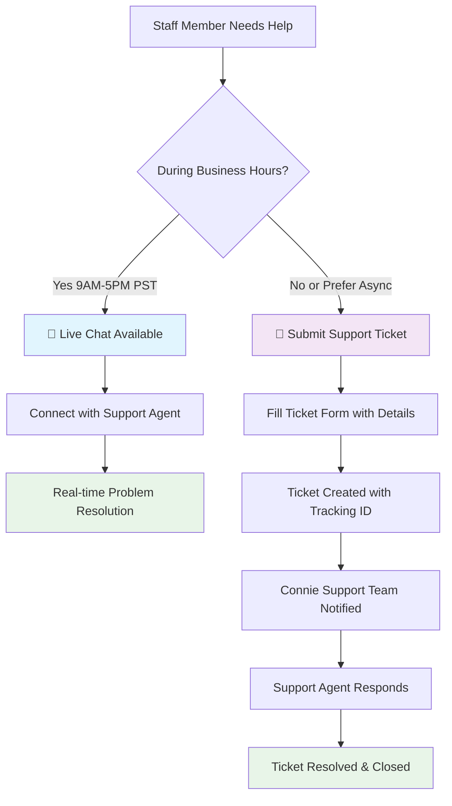

# CDO Content Collection for docs.connie

## 1. Data Integration Section (Under Developer Setup)

### Key Content to Include:

#### Frame Ancestors & CSP Headers
**Critical Finding**: CSP headers MUST be set at the edge (vercel.json) for production performance and coverage.

```json
// vercel.json - PRODUCTION (Best Practice)
{
  "headers": [
    {
      "source": "/(.*)", 
      "headers": [
        {
          "key": "Content-Security-Policy",
          "value": "frame-ancestors 'self' https://flex.twilio.com https://*.flex.twilio.com https://*.twilio.com https://*.twil.io https://connie.team https://*.connie.team [LIST ALL SUBDOMAINS]"
        }
      ]
    }
  ]
}
```

**Why Location Matters**:
- `vercel.json`: Edge-level, covers ALL resources, best performance
- `next.config.js`: Build-time, only Next.js routes, good for dev
- `middleware.ts`: Runtime, performance hit, use only if dynamic

**Critical Limitation**: Cannot use wildcards (*.connie.team) in frame-ancestors. Must explicitly list each subdomain.

#### Integration Levels (From basecamp notes)
- Level 1: Basic iframe with uriCallback
- Level 2: Server-side processing (no CORS)
- Level 3: Proxy functions with auth
- Level 4: HIPAA compliant

#### Proven Pattern from HHOVV Integration
1. Server-side HTML generation (no client-side API calls)
2. CSP headers for iframe embedding
3. uriCallback for dynamic URLs
4. Profile data passed via query parameters

---

## 2. Ticket Manager Section (Under Feature Management)

### Key Content to Include:

#### Architecture
- Standalone Next.js app on Vercel
- PostgreSQL via @vercel/postgres
- Designed for iframe embedding in Flex

#### Database Setup
**Critical Step**: Must manually add POSTGRES_URL environment variable
- Neon creates `POSTGRES_POSTGRES_URL` with prefix
- @vercel/postgres expects `POSTGRES_URL`
- Manual mapping required in Vercel dashboard

#### Integration with Flex
- Query parameters for data passing: `?name=X&phone=Y`
- CSP headers for iframe embedding
- Future: postMessage for bidirectional communication

#### Deployment Checklist
1. Create Neon database in Vercel
2. Fix environment variable naming
3. Set CSP headers in vercel.json
4. Test iframe embedding

---

---

## 3. End-Users > Get Help Section (NEW CATEGORY)

### Support Flow Overview


### Support Options Detail

#### Live Chat (Business Hours)
- **Availability**: 9 AM - 5 PM PST, Monday-Friday
- **Best For**: Urgent issues, quick questions, training help
- **Response Time**: Immediate (under 2 minutes)
- **Features**: Screen sharing, real-time troubleshooting

#### Support Tickets (24/7)
- **Availability**: Always available
- **Best For**: Detailed issues, after-hours support, feature requests
- **Response Time**: Within 24 hours (typically much faster)
- **Features**: File attachments, progress tracking, searchable history

### Account Context Integration
**Multi-Account Support**: NSS, HHOVV, DevSandBox staff all get help via same system
- Tickets automatically include account information
- Support team sees which organization needs help
- All tickets route to central Connie support team (RTC+Flex)

---

## Notes for CDO:
- Emphasize the CSP header location decision (edge vs build vs runtime)
- Include the POSTGRES_URL naming issue as a common pitfall
- Reference the HHOVV breakthrough as the proven pattern
- Add troubleshooting section for iframe embedding issues
- Include the mermaid diagram exactly as shown above
- Explain why email support was removed (tracking, efficiency)